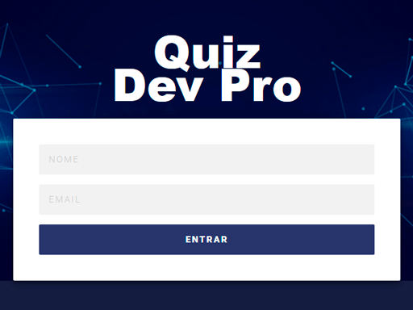

# QUIZ
    
_Criada durante a Jornada Rumo a Primeira Vaga organizada pela Python DevPro, com Renzo Nuccitelli_  

  
### Aplicação desenvolvida em Python e Django para criação de questionários tipo Quiz com login do partipante e ranking dos melhores colocados na competição.  
  
  

  
**Tecnologias utilizadas**: Python, Django, HTML, CSS, JS 
**Versão**: 0.1

### Passo a passo
1. Criar projeto php no pycharm;
2. Instalar o django através do comando:  *pip instal django*;
3. Criar projeto django com o comando: *django-admin startproject quiz_dev .*;
4. Verificar se o projeto foi criado corretamente executando o servidor por meio do comando: *php manage.py runserver*; 
5. No navegador, acesse o endereço *http://localhost:8000*. Caso tenha tudo dado certo, será exibida a página do Django;
6. Navegar para o diretório quiz_dev (*cd quiz_dev*) e em seguida digitar o comando *python ..\manage.py startapp quiz*;
7. Editar o arquivo settings.py e, no final da seção *INSTALLED_APPS*, incluir: *'quiz_dev.quiz'*;
8. Criar em .\quiz_dev\quiz o diretório static, incluindo os arquivos estáticos html, css e js, existentes no projeto;